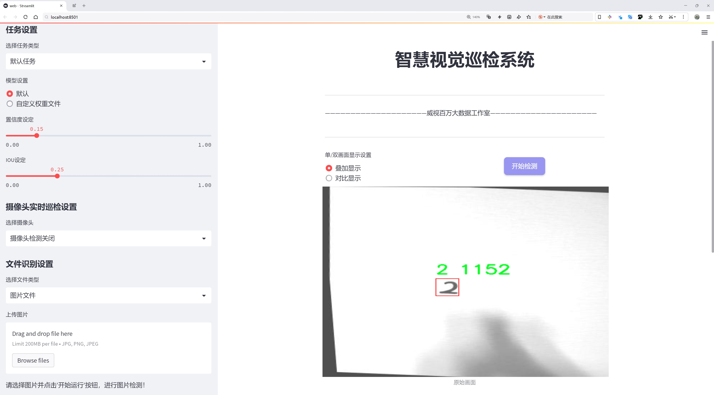
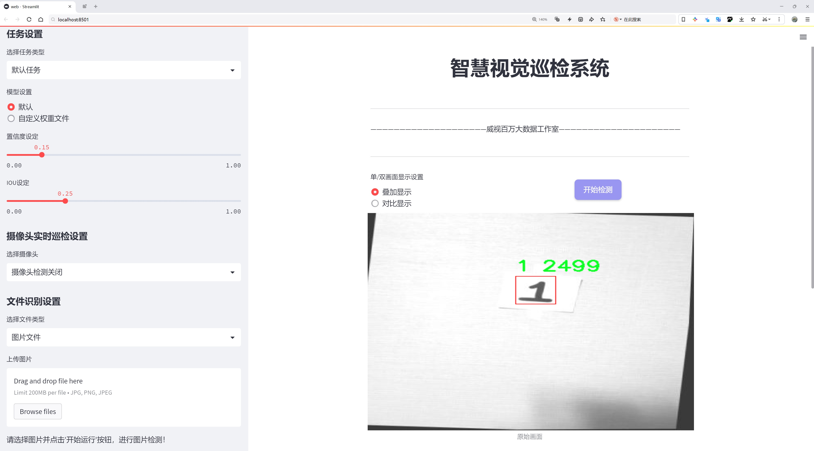
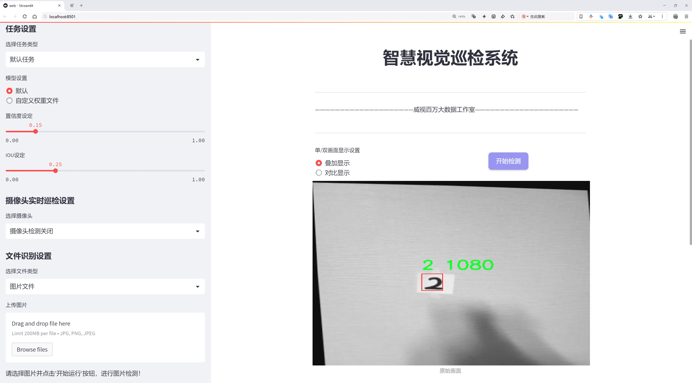
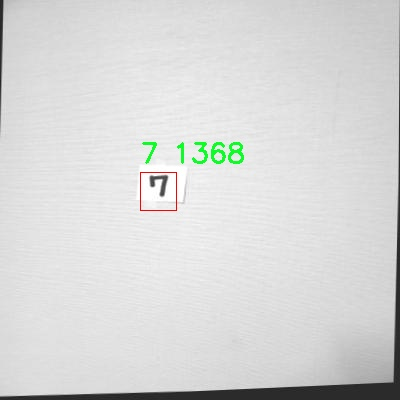
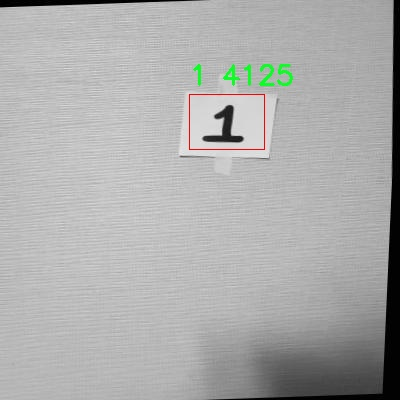
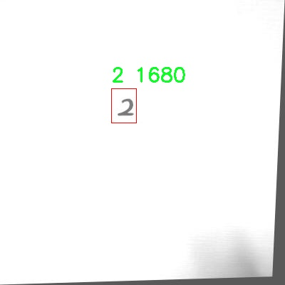
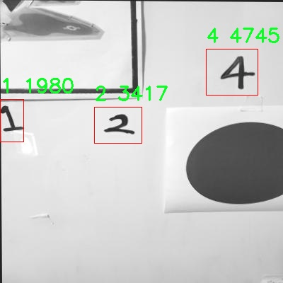
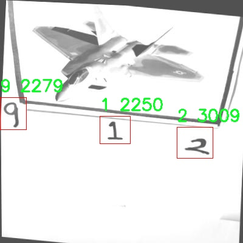

# 手写数字识别检测系统源码分享
 # [一条龙教学YOLOV8标注好的数据集一键训练_70+全套改进创新点发刊_Web前端展示]

### 1.研究背景与意义

项目参考[AAAI Association for the Advancement of Artificial Intelligence](https://gitee.com/qunmasj/projects)

项目来源[AACV Association for the Advancement of Computer Vision](https://kdocs.cn/l/cszuIiCKVNis)

研究背景与意义

随着人工智能技术的迅猛发展，计算机视觉领域在图像识别、物体检测等方面取得了显著的进展。手写数字识别作为计算机视觉中的一个重要应用，广泛应用于银行支票处理、邮政编码识别、表单自动化等场景。传统的手写数字识别方法主要依赖于特征提取和分类器设计，然而这些方法在面对复杂的手写体时往往表现不佳。近年来，深度学习技术的兴起为手写数字识别提供了新的解决方案，尤其是卷积神经网络（CNN）在图像分类和目标检测任务中的成功应用，使得手写数字识别的准确性和效率得到了显著提升。

在众多深度学习模型中，YOLO（You Only Look Once）系列模型因其实时性和高效性而备受关注。YOLOv8作为该系列的最新版本，结合了多种先进的技术，进一步提升了目标检测的性能。然而，尽管YOLOv8在一般物体检测任务中表现出色，但在特定的手写数字识别任务中，仍然存在一定的改进空间。为了更好地适应手写数字的多样性和复杂性，基于YOLOv8的改进方案显得尤为重要。

本研究旨在基于改进的YOLOv8模型，构建一个高效的手写数字识别系统。所使用的数据集包含2100张手写数字图像，涵盖了从0到9的10个类别。这一数据集的规模和多样性为模型的训练和测试提供了良好的基础。通过对数据集的深入分析，我们可以发现，手写数字的书写风格差异较大，可能会对识别结果产生影响。因此，在模型的改进过程中，我们将考虑数据增强、特征提取和模型优化等多种策略，以提高模型在手写数字识别任务中的鲁棒性和准确性。

本研究的意义不仅在于提升手写数字识别的准确率，更在于为后续的研究提供一个可行的框架和方法论。通过对YOLOv8的改进，我们希望能够为其他领域的目标检测任务提供借鉴，尤其是在处理具有高度变异性和复杂性的图像数据时。此外，手写数字识别的成功应用将推动智能化办公、自动化处理等领域的发展，具有重要的社会和经济价值。

综上所述，基于改进YOLOv8的手写数字识别系统的研究，不仅具有理论上的创新意义，也在实际应用中展现出广泛的前景。通过不断优化和完善模型，我们期待能够在手写数字识别领域取得突破性进展，为推动人工智能技术的应用与发展贡献力量。

### 2.图片演示







##### 注意：由于此博客编辑较早，上面“2.图片演示”和“3.视频演示”展示的系统图片或者视频可能为老版本，新版本在老版本的基础上升级如下：（实际效果以升级的新版本为准）

  （1）适配了YOLOV8的“目标检测”模型和“实例分割”模型，通过加载相应的权重（.pt）文件即可自适应加载模型。

  （2）支持“图片识别”、“视频识别”、“摄像头实时识别”三种识别模式。

  （3）支持“图片识别”、“视频识别”、“摄像头实时识别”三种识别结果保存导出，解决手动导出（容易卡顿出现爆内存）存在的问题，识别完自动保存结果并导出到tempDir中。

  （4）支持Web前端系统中的标题、背景图等自定义修改，后面提供修改教程。

  另外本项目提供训练的数据集和训练教程,暂不提供权重文件（best.pt）,需要您按照教程进行训练后实现图片演示和Web前端界面演示的效果。

### 3.视频演示

[3.1 视频演示](https://www.bilibili.com/video/BV1CHxheJEob/)

### 4.数据集信息展示

##### 4.1 本项目数据集详细数据（类别数＆类别名）

nc: 10
names: ['0', '1', '2', '3', '4', '5', '6', '7', '8', '9']


##### 4.2 本项目数据集信息介绍

数据集信息展示

在本研究中，我们使用了名为“1num9”的数据集，旨在改进YOLOv8手写数字识别系统。该数据集专门为手写数字的识别任务而设计，包含了丰富的样本和多样化的手写风格，能够有效地提升模型的泛化能力和识别准确率。数据集的类别数量为10，涵盖了从0到9的所有阿拉伯数字，这些类别的命名为['0', '1', '2', '3', '4', '5', '6', '7', '8', '9']，每个类别均代表一种数字的手写形式。

“1num9”数据集的构建过程注重多样性和代表性，确保每个数字类别都有足够的样本量，以便于模型在训练过程中能够学习到不同书写风格和笔画顺序的特征。这种多样性不仅体现在书写者的不同，还包括书写工具、纸张类型以及书写环境等因素，旨在模拟真实世界中可能遇到的各种情况。通过这样的设计，数据集能够为YOLOv8模型提供丰富的训练素材，使其在面对各种手写数字时，能够保持较高的识别精度。

数据集的样本来源广泛，包含了来自不同年龄段、性别和文化背景的书写者的手写数字。这种广泛的样本来源使得数据集在处理手写数字时具有更强的鲁棒性，能够适应不同用户的书写习惯。此外，数据集中的每个样本都经过精心标注，确保数字的边界框和类别标签准确无误，为模型的训练提供了可靠的基础。

在数据预处理阶段，我们对“1num9”数据集进行了必要的增强处理，以提升模型的训练效果。通过旋转、缩放、平移等方式，我们增加了数据集的多样性，进一步提高了模型对手写数字的识别能力。这些增强技术不仅可以防止模型过拟合，还能提高其在实际应用中的表现，使得模型在面对未知数据时，依然能够保持良好的识别性能。

在模型训练过程中，我们采用了分层抽样的方法，从“1num9”数据集中随机抽取样本，以确保每个数字类别在训练集和验证集中的比例均衡。这种方法有助于模型在学习过程中，不偏向于某一特定类别，从而提高整体的识别准确率。

总之，“1num9”数据集为改进YOLOv8手写数字识别系统提供了坚实的基础。通过对数据集的精心设计和处理，我们期望能够训练出一个在多种手写风格下均能表现优异的数字识别模型。这一研究不仅为手写数字识别领域的进一步发展提供了新的思路，也为相关应用的实际落地奠定了基础。未来，我们将继续探索数据集的扩展和模型的优化，以推动手写数字识别技术的进步。











### 5.全套项目环境部署视频教程（零基础手把手教学）

[5.1 环境部署教程链接（零基础手把手教学）](https://www.ixigua.com/7404473917358506534?logTag=c807d0cbc21c0ef59de5)


[5.2 安装Python虚拟环境创建和依赖库安装视频教程链接（零基础手把手教学）](https://www.ixigua.com/7404474678003106304?logTag=1f1041108cd1f708b01a)

### 6.手把手YOLOV8训练视频教程（零基础小白有手就能学会）

[6.1 手把手YOLOV8训练视频教程（零基础小白有手就能学会）](https://www.ixigua.com/7404477157818401292?logTag=d31a2dfd1983c9668658)

### 7.70+种全套YOLOV8创新点代码加载调参视频教程（一键加载写好的改进模型的配置文件）

[7.1 70+种全套YOLOV8创新点代码加载调参视频教程（一键加载写好的改进模型的配置文件）](https://www.ixigua.com/7404478314661806627?logTag=29066f8288e3f4eea3a4)

### 8.70+种全套YOLOV8创新点原理讲解（非科班也可以轻松写刊发刊，V10版本正在科研待更新）

由于篇幅限制，每个创新点的具体原理讲解就不一一展开，具体见下列网址中的创新点对应子项目的技术原理博客网址【Blog】：


[8.1 70+种全套YOLOV8创新点原理讲解链接](https://gitee.com/qunmasj/good)

### 9.系统功能展示（检测对象为举例，实际内容以本项目数据集为准）

图9.1.系统支持检测结果表格显示

  图9.2.系统支持置信度和IOU阈值手动调节

  图9.3.系统支持自定义加载权重文件best.pt(需要你通过步骤5中训练获得)

  图9.4.系统支持摄像头实时识别

  图9.5.系统支持图片识别

  图9.6.系统支持视频识别

  图9.7.系统支持识别结果文件自动保存

  图9.8.系统支持Excel导出检测结果数据


### 10.原始YOLOV8算法原理

原始YOLOv8算法原理

YOLOv8算法作为YOLO系列的最新版本，承载着目标检测领域的诸多创新与进步。它在YOLOv7的基础上进行了深度优化，旨在提高目标检测的精度和速度，同时保持模型的轻量化特性。YOLOv8的设计理念源于对前几代YOLO模型的深刻理解与改进，特别是在网络结构、特征提取、特征融合及检测策略等方面的全面提升，使其在实际应用中表现出色。

首先，YOLOv8的网络结构由主干网络、特征增强网络和检测头三部分组成。主干网络负责从输入图像中提取特征，YOLOv8采用了CSP（Cross Stage Partial）结构，这种结构通过将特征图分割并在不同的路径中进行处理，有效地减轻了计算负担，同时提升了特征提取的能力。相较于以往的YOLO版本，YOLOv8在主干网络中引入了C2F模块，这一模块通过更轻量化的卷积操作，进一步提高了特征提取的效率和准确性。

在特征增强网络方面，YOLOv8结合了特征金字塔网络（FPN）和路径聚合网络（PAN）的优势，形成了一个高效的特征融合机制。特征金字塔网络通过多尺度特征的提取与融合，使得模型能够更好地处理不同尺度的目标。而路径聚合网络则通过跨层连接，增强了特征的传递与融合能力，确保了不同层次特征信息的有效利用。为了进一步提升特征融合的效率，YOLOv8还引入了BiFPN（Bidirectional Feature Pyramid Network），这种网络结构通过双向连接和加权特征融合的方式，显著提高了对不同尺度特征信息的提取速度和准确性。

在检测头部分，YOLOv8采用了解耦头的设计，这一创新使得目标的分类与定位任务可以独立进行。传统的耦合头在处理复杂场景时常常面临定位不准和分类错误的问题，而解耦头通过将分类和回归任务分开，使得每个任务能够更加专注于自身的目标，从而提高了整体的检测性能。此外，YOLOv8引入了无锚目标检测的方法，取代了传统的锚框机制。通过直接回归目标的位置和大小，YOLOv8能够更快速地聚焦于目标区域，减少了对锚框选择和调整的依赖，极大地简化了模型的设计与应用。

YOLOv8在训练过程中采用了多尺度训练和测试策略，这一策略通过在不同尺度下进行训练，使得模型能够更好地适应各种目标的变化。这种灵活性不仅提升了模型的鲁棒性，也使得YOLOv8在面对复杂场景时，能够有效地进行目标检测。此外，YOLOv8还在损失函数的设计上进行了优化，以提高模型的训练效果，确保在不同数据集上的表现均衡。

在实际应用中，YOLOv8展现出了极高的效率与准确性。与之前的YOLO版本相比，YOLOv8在精度和帧率上均有显著提升，尤其是在处理实时检测任务时，其轻量化的特性使得模型能够在嵌入式设备上高效运行。这一特性使得YOLOv8在智能监控、自动驾驶、人脸识别等领域得到了广泛应用，成为目标检测任务中的一个重要工具。

综上所述，YOLOv8算法通过对网络结构的优化、特征提取与融合的改进、检测策略的创新，成功地提升了目标检测的性能。其轻量化设计不仅满足了实时检测的需求，也为各种应用场景提供了强有力的支持。随着YOLOv8的推广与应用，目标检测技术的未来将更加光明，推动着智能视觉系统的不断进步与发展。


### 11.项目核心源码讲解（再也不用担心看不懂代码逻辑）

#### 11.1 ui.py

以下是对代码的核心部分进行提炼和详细注释的版本：

```python
import sys
import subprocess

def run_script(script_path):
    """
    使用当前 Python 环境运行指定的脚本。

    Args:
        script_path (str): 要运行的脚本路径

    Returns:
        None
    """
    # 获取当前 Python 解释器的路径
    python_path = sys.executable

    # 构建运行命令，使用 streamlit 运行指定的脚本
    command = f'"{python_path}" -m streamlit run "{script_path}"'

    # 执行命令，并等待其完成
    result = subprocess.run(command, shell=True)
    
    # 检查命令执行的返回码，非零表示出错
    if result.returncode != 0:
        print("脚本运行出错。")

# 程序入口
if __name__ == "__main__":
    # 指定要运行的脚本路径
    script_path = "web.py"  # 假设脚本在当前目录下

    # 调用函数运行脚本
    run_script(script_path)
```

### 代码分析与注释：

1. **导入模块**：
   - `sys`：用于访问与 Python 解释器紧密相关的变量和函数。
   - `subprocess`：用于执行外部命令和程序。

2. **定义 `run_script` 函数**：
   - 该函数接受一个参数 `script_path`，表示要运行的 Python 脚本的路径。
   - 使用 `sys.executable` 获取当前 Python 解释器的路径，以确保脚本在正确的环境中运行。
   - 构建一个命令字符串，使用 `streamlit` 模块运行指定的脚本。
   - 使用 `subprocess.run` 执行命令，并等待其完成。
   - 检查命令的返回码，如果返回码不为零，表示脚本运行出错，打印错误信息。

3. **程序入口**：
   - 使用 `if __name__ == "__main__":` 确保只有在直接运行该脚本时才会执行以下代码。
   - 指定要运行的脚本路径为 `web.py`，可以根据需要修改为其他路径。
   - 调用 `run_script` 函数来执行指定的脚本。 

这样，代码的核心逻辑和功能得以保留，并且每个部分都有详细的中文注释，便于理解。

这个程序文件名为 `ui.py`，它的主要功能是运行一个指定的 Python 脚本，具体来说是使用 Streamlit 框架来启动一个 Web 应用。

首先，文件导入了一些必要的模块，包括 `sys`、`os` 和 `subprocess`。其中，`sys` 模块用于访问与 Python 解释器相关的变量和函数，`os` 模块提供了与操作系统交互的功能，而 `subprocess` 模块则用于执行外部命令。

接下来，程序定义了一个名为 `run_script` 的函数，该函数接受一个参数 `script_path`，表示要运行的脚本的路径。在函数内部，首先获取当前 Python 解释器的路径，这样可以确保在正确的环境中运行脚本。然后，构建一个命令字符串，使用 `streamlit run` 命令来运行指定的脚本。这个命令会在命令行中执行，启动 Streamlit 应用。

使用 `subprocess.run` 方法来执行构建好的命令，并且通过 `shell=True` 参数允许在 shell 中执行该命令。执行完命令后，程序检查返回的状态码，如果不为零，表示脚本运行出错，程序会输出一条错误信息。

在文件的最后部分，使用 `if __name__ == "__main__":` 语句来确保只有在直接运行该脚本时才会执行后面的代码。这部分代码指定了要运行的脚本路径，这里是通过调用 `abs_path("web.py")` 来获取 `web.py` 文件的绝对路径。最后，调用 `run_script` 函数来执行这个脚本。

总体来说，这个文件的作用是为一个 Streamlit 应用提供一个启动入口，通过命令行运行指定的 Python 脚本，方便用户在本地环境中启动和测试 Web 应用。

#### 11.2 70+种YOLOv8算法改进源码大全和调试加载训练教程（非必要）\ultralytics\cfg\__init__.py

以下是代码中最核心的部分，并附上详细的中文注释：

```python
def cfg2dict(cfg):
    """
    将配置对象转换为字典格式，支持文件路径、字符串或SimpleNamespace对象。

    参数:
        cfg (str | Path | dict | SimpleNamespace): 要转换为字典的配置对象。

    返回:
        cfg (dict): 转换后的字典格式配置对象。
    """
    if isinstance(cfg, (str, Path)):
        cfg = yaml_load(cfg)  # 从文件加载字典
    elif isinstance(cfg, SimpleNamespace):
        cfg = vars(cfg)  # 将SimpleNamespace转换为字典
    return cfg


def get_cfg(cfg: Union[str, Path, Dict, SimpleNamespace] = DEFAULT_CFG_DICT, overrides: Dict = None):
    """
    从文件或字典加载并合并配置数据。

    参数:
        cfg (str | Path | Dict | SimpleNamespace): 配置数据。
        overrides (str | Dict | optional): 覆盖的配置，形式为文件名或字典。默认为None。

    返回:
        (SimpleNamespace): 训练参数的命名空间。
    """
    cfg = cfg2dict(cfg)  # 将配置转换为字典

    # 合并覆盖的配置
    if overrides:
        overrides = cfg2dict(overrides)
        if 'save_dir' not in cfg:
            overrides.pop('save_dir', None)  # 忽略特殊的覆盖键
        check_dict_alignment(cfg, overrides)  # 检查字典对齐
        cfg = {**cfg, **overrides}  # 合并cfg和覆盖字典（优先使用覆盖）

    # 特殊处理数字类型的项目名称
    for k in 'project', 'name':
        if k in cfg and isinstance(cfg[k], (int, float)):
            cfg[k] = str(cfg[k])  # 将数字转换为字符串
    if cfg.get('name') == 'model':  # 将模型名称赋值给'name'参数
        cfg['name'] = cfg.get('model', '').split('.')[0]
        LOGGER.warning(f"WARNING ⚠️ 'name=model' 自动更新为 'name={cfg['name']}'.")

    # 类型和值检查
    for k, v in cfg.items():
        if v is not None:  # None值可能来自可选参数
            if k in CFG_FLOAT_KEYS and not isinstance(v, (int, float)):
                raise TypeError(f"'{k}={v}' 的类型 {type(v).__name__} 无效. "
                                f"有效的 '{k}' 类型是 int（例如 '{k}=0'）或 float（例如 '{k}=0.5'）")
            elif k in CFG_FRACTION_KEYS:
                if not isinstance(v, (int, float)):
                    raise TypeError(f"'{k}={v}' 的类型 {type(v).__name__} 无效. "
                                    f"有效的 '{k}' 类型是 int（例如 '{k}=0'）或 float（例如 '{k}=0.5'）")
                if not (0.0 <= v <= 1.0):
                    raise ValueError(f"'{k}={v}' 的值无效. "
                                     f"有效的 '{k}' 值在 0.0 和 1.0 之间。")
            elif k in CFG_INT_KEYS and not isinstance(v, int):
                raise TypeError(f"'{k}={v}' 的类型 {type(v).__name__} 无效. "
                                f"'{k}' 必须是 int（例如 '{k}=8'）")
            elif k in CFG_BOOL_KEYS and not isinstance(v, bool):
                raise TypeError(f"'{k}={v}' 的类型 {type(v).__name__} 无效. "
                                f"'{k}' 必须是 bool（例如 '{k}=True' 或 '{k}=False'）")

    # 返回命名空间实例
    return IterableSimpleNamespace(**cfg)


def entrypoint(debug=''):
    """
    该函数是ultralytics包的入口点，负责解析传递给包的命令行参数。

    该函数允许：
    - 传递强制的YOLO参数作为字符串列表
    - 指定要执行的任务，例如'detect'、'segment'或'classify'
    - 指定模式，例如'train'、'val'、'test'或'predict'
    - 运行特殊模式，如'checks'
    - 传递覆盖包配置的参数

    它使用包的默认配置并使用传递的覆盖进行初始化。
    然后调用带有组合配置的CLI函数。
    """
    args = (debug.split(' ') if debug else sys.argv)[1:]  # 获取命令行参数
    if not args:  # 如果没有参数
        LOGGER.info(CLI_HELP_MSG)  # 输出帮助信息
        return

    # 定义特殊命令
    special = {
        'help': lambda: LOGGER.info(CLI_HELP_MSG),
        'checks': checks.collect_system_info,
        'version': lambda: LOGGER.info(__version__),
        'settings': lambda: handle_yolo_settings(args[1:]),
        'cfg': lambda: yaml_print(DEFAULT_CFG_PATH),
        'hub': lambda: handle_yolo_hub(args[1:]),
        'login': lambda: handle_yolo_hub(args),
        'copy-cfg': copy_default_cfg
    }
    
    # 创建完整的参数字典
    full_args_dict = {**DEFAULT_CFG_DICT, **{k: None for k in TASKS}, **{k: None for k in MODES}, **special}

    # 处理参数
    overrides = {}  # 基本覆盖，例如 imgsz=320
    for a in merge_equals_args(args):  # 合并等号周围的空格
        if '=' in a:
            try:
                k, v = parse_key_value_pair(a)  # 解析参数对
                overrides[k] = v  # 存储覆盖
            except (NameError, SyntaxError, ValueError, AssertionError) as e:
                check_dict_alignment(full_args_dict, {a: ''}, e)  # 检查参数对齐

        elif a in TASKS:
            overrides['task'] = a  # 记录任务
        elif a in MODES:
            overrides['mode'] = a  # 记录模式
        elif a.lower() in special:
            special[a.lower()]()  # 执行特殊命令
            return
        else:
            check_dict_alignment(full_args_dict, {a: ''})  # 检查参数对齐

    # 检查参数的有效性
    check_dict_alignment(full_args_dict, overrides)

    # 运行命令
    mode = overrides.get('mode', DEFAULT_CFG.mode or 'predict')  # 获取模式
    task = overrides.pop('task', None)  # 获取任务
    model = overrides.pop('model', DEFAULT_CFG.model)  # 获取模型

    # 根据模式执行相应的操作
    getattr(model, mode)(**overrides)  # 调用模型的相应方法

    # 输出帮助信息
    LOGGER.info(f'💡 了解更多信息请访问 https://docs.ultralytics.com/modes/{mode}')
```

### 代码说明：
1. **cfg2dict**: 将配置对象转换为字典格式，支持多种输入类型。
2. **get_cfg**: 加载和合并配置数据，进行类型和值的检查，确保配置的有效性。
3. **entrypoint**: 作为程序的入口，解析命令行参数，处理任务和模式，最终调用相应的模型方法执行操作。

这个程序文件是YOLOv8算法的一个核心模块，主要负责配置管理和命令行接口的处理。它允许用户通过命令行与YOLOv8模型进行交互，执行不同的任务，如训练、验证、预测等。文件开头引入了一些必要的库和模块，定义了一些常量和配置项，包括有效的任务和模式、模型文件、数据集等。

在代码中，定义了多个函数来处理配置和命令行参数。例如，`cfg2dict`函数用于将配置对象转换为字典格式，支持字符串、路径、字典和SimpleNamespace对象。`get_cfg`函数则负责加载和合并配置数据，并进行类型和数值检查，确保配置的有效性。

此外，文件中还定义了一些处理命令行参数的函数，如`merge_equals_args`用于合并参数，`handle_yolo_hub`和`handle_yolo_settings`分别处理与Ultralytics HUB和YOLO设置相关的命令。`entrypoint`函数是程序的入口，负责解析命令行参数并根据用户输入执行相应的操作。

在处理参数时，程序会检查用户输入的有效性，并根据默认配置和用户的覆盖配置来设置模型的任务、模式和其他参数。对于不同的模式（如训练、验证、预测等），程序会根据需要加载相应的数据和模型，并最终调用模型的相关方法执行任务。

最后，文件还提供了一些帮助信息和文档链接，方便用户查阅和学习如何使用YOLOv8。整体而言，这个模块是YOLOv8框架中不可或缺的一部分，负责管理配置和用户交互，使得模型的使用更加灵活和方便。

#### 11.3 70+种YOLOv8算法改进源码大全和调试加载训练教程（非必要）\ultralytics\hub\auth.py

以下是代码中最核心的部分，并附上详细的中文注释：

```python
import requests

class Auth:
    """
    处理身份验证过程，包括API密钥管理、基于cookie的身份验证和头部生成。

    支持不同的身份验证方法：
    1. 直接使用API密钥。
    2. 使用浏览器cookie进行身份验证（特别是在Google Colab中）。
    3. 提示用户输入API密钥。
    """
    id_token = api_key = model_key = False  # 初始化身份验证相关的属性

    def __init__(self, api_key='', verbose=False):
        """
        初始化Auth类，接受一个可选的API密钥。

        参数：
            api_key (str, optional): API密钥或组合的API密钥和模型ID
        """
        # 如果API密钥包含模型ID，则只保留API密钥部分
        api_key = api_key.split('_')[0]

        # 设置API密钥属性，如果没有提供则使用设置中的API密钥
        self.api_key = api_key or SETTINGS.get('api_key', '')

        # 如果提供了API密钥
        if self.api_key:
            # 检查提供的API密钥是否与设置中的API密钥匹配
            if self.api_key == SETTINGS.get('api_key'):
                if verbose:
                    LOGGER.info(f'已认证 ✅')
                return
            else:
                # 尝试使用提供的API密钥进行身份验证
                success = self.authenticate()
        # 如果没有提供API密钥并且环境是Google Colab
        elif is_colab():
            # 尝试使用浏览器cookie进行身份验证
            success = self.auth_with_cookies()
        else:
            # 请求用户输入API密钥
            success = self.request_api_key()

        # 在成功身份验证后更新设置中的API密钥
        if success:
            SETTINGS.update({'api_key': self.api_key})
            if verbose:
                LOGGER.info(f'新认证成功 ✅')
        elif verbose:
            LOGGER.info(f'从 {API_KEY_URL} 获取API密钥')

    def authenticate(self) -> bool:
        """
        尝试使用id_token或API密钥进行身份验证。

        返回：
            bool: 如果身份验证成功则返回True，否则返回False。
        """
        try:
            header = self.get_auth_header()  # 获取身份验证头部
            if header:
                r = requests.post(f'{HUB_API_ROOT}/v1/auth', headers=header)  # 发送身份验证请求
                if not r.json().get('success', False):
                    raise ConnectionError('无法进行身份验证。')
                return True
            raise ConnectionError('用户尚未本地认证。')
        except ConnectionError:
            self.id_token = self.api_key = False  # 重置无效的身份验证信息
            LOGGER.warning('无效的API密钥 ⚠️')
            return False

    def auth_with_cookies(self) -> bool:
        """
        尝试通过cookie获取身份验证并设置id_token。用户必须已登录HUB并在支持的浏览器中运行。

        返回：
            bool: 如果身份验证成功则返回True，否则返回False。
        """
        if not is_colab():
            return False  # 目前仅在Colab中有效
        try:
            authn = request_with_credentials(f'{HUB_API_ROOT}/v1/auth/auto')  # 请求自动身份验证
            if authn.get('success', False):
                self.id_token = authn.get('data', {}).get('idToken', None)  # 设置id_token
                self.authenticate()  # 进行身份验证
                return True
            raise ConnectionError('无法获取浏览器身份验证信息。')
        except ConnectionError:
            self.id_token = False  # 重置无效的id_token
            return False

    def get_auth_header(self):
        """
        获取用于进行API请求的身份验证头部。

        返回：
            (dict): 如果设置了id_token或API密钥，则返回身份验证头部，否则返回None。
        """
        if self.id_token:
            return {'authorization': f'Bearer {self.id_token}'}  # 使用id_token生成头部
        elif self.api_key:
            return {'x-api-key': self.api_key}  # 使用API密钥生成头部
        return None  # 如果都没有，则返回None
```

### 代码说明：
1. **Auth类**：负责处理身份验证，包括API密钥和cookie的管理。
2. **初始化方法**：根据提供的API密钥或环境（如Colab）进行身份验证。
3. **authenticate方法**：向服务器发送身份验证请求，并根据返回结果判断是否成功。
4. **auth_with_cookies方法**：在Colab环境中使用浏览器cookie进行身份验证。
5. **get_auth_header方法**：根据是否有有效的id_token或API密钥生成请求头部。

这个程序文件是一个用于管理身份验证的类，名为 `Auth`，它主要用于处理与 Ultralytics YOLO 的 API 交互中的身份验证过程。文件的开头包含了相关的导入语句，导入了处理请求的库以及一些工具函数和常量。

`Auth` 类的主要功能是支持多种身份验证方式，包括直接使用 API 密钥、通过浏览器 cookie 进行身份验证（特别是在 Google Colab 环境中），以及提示用户输入 API 密钥。类中定义了几个属性，包括 `id_token`、`api_key` 和 `model_key`，这些属性用于存储身份验证所需的信息，初始值均为 `False`。

在 `__init__` 方法中，类会尝试初始化 API 密钥。如果用户提供了 API 密钥，程序会检查该密钥是否与设置中的密钥匹配。如果匹配，表示用户已经登录；如果不匹配，则尝试使用提供的密钥进行身份验证。如果没有提供 API 密钥且当前环境是 Google Colab，程序会尝试通过浏览器 cookie 进行身份验证；如果都不满足，则会请求用户输入 API 密钥。

`request_api_key` 方法用于提示用户输入 API 密钥，最多尝试三次。如果用户输入的密钥能够成功通过身份验证，方法将返回 `True`，否则会抛出连接错误。

`authenticate` 方法则是实际进行身份验证的核心逻辑，它会向服务器发送请求，检查身份验证是否成功。如果成功，返回 `True`，否则返回 `False`，并重置无效的身份验证信息。

`auth_with_cookies` 方法专门用于在 Google Colab 环境中通过 cookie 进行身份验证。它会尝试获取浏览器的身份验证信息，并调用 `authenticate` 方法进行验证。

最后，`get_auth_header` 方法用于生成用于 API 请求的身份验证头。如果 `id_token` 或 `api_key` 存在，则返回相应的头信息；如果都不存在，则返回 `None`。

整体来看，这个文件的主要目的是提供一个灵活的身份验证机制，以便用户能够方便地与 Ultralytics YOLO 的 API 进行交互。

#### 11.4 70+种YOLOv8算法改进源码大全和调试加载训练教程（非必要）\ultralytics\models\sam\build.py

以下是经过简化并注释的核心代码部分，主要用于构建不同大小的Segment Anything Model（SAM）模型。

```python
import torch
from functools import partial
from ultralytics.utils.downloads import attempt_download_asset
from .modules.decoders import MaskDecoder
from .modules.encoders import ImageEncoderViT, PromptEncoder
from .modules.sam import Sam
from .modules.tiny_encoder import TinyViT
from .modules.transformer import TwoWayTransformer

def _build_sam(encoder_embed_dim,
               encoder_depth,
               encoder_num_heads,
               encoder_global_attn_indexes,
               checkpoint=None,
               mobile_sam=False):
    """构建选定的SAM模型架构。"""
    
    # 定义提示嵌入维度和图像大小
    prompt_embed_dim = 256
    image_size = 1024
    vit_patch_size = 16
    image_embedding_size = image_size // vit_patch_size  # 计算图像嵌入大小

    # 根据是否为移动SAM选择不同的图像编码器
    image_encoder = (TinyViT(
        img_size=1024,
        in_chans=3,
        num_classes=1000,
        embed_dims=encoder_embed_dim,
        depths=encoder_depth,
        num_heads=encoder_num_heads,
        window_sizes=[7, 7, 14, 7],
        mlp_ratio=4.0,
        drop_rate=0.0,
        drop_path_rate=0.0,
        use_checkpoint=False,
        mbconv_expand_ratio=4.0,
        local_conv_size=3,
    ) if mobile_sam else ImageEncoderViT(
        depth=encoder_depth,
        embed_dim=encoder_embed_dim,
        img_size=image_size,
        mlp_ratio=4,
        norm_layer=partial(torch.nn.LayerNorm, eps=1e-6),
        num_heads=encoder_num_heads,
        patch_size=vit_patch_size,
        qkv_bias=True,
        use_rel_pos=True,
        global_attn_indexes=encoder_global_attn_indexes,
        window_size=14,
        out_chans=prompt_embed_dim,
    ))

    # 创建SAM模型
    sam = Sam(
        image_encoder=image_encoder,
        prompt_encoder=PromptEncoder(
            embed_dim=prompt_embed_dim,
            image_embedding_size=(image_embedding_size, image_embedding_size),
            input_image_size=(image_size, image_size),
            mask_in_chans=16,
        ),
        mask_decoder=MaskDecoder(
            num_multimask_outputs=3,
            transformer=TwoWayTransformer(
                depth=2,
                embedding_dim=prompt_embed_dim,
                mlp_dim=2048,
                num_heads=8,
            ),
            transformer_dim=prompt_embed_dim,
            iou_head_depth=3,
            iou_head_hidden_dim=256,
        ),
        pixel_mean=[123.675, 116.28, 103.53],  # 图像像素均值
        pixel_std=[58.395, 57.12, 57.375],      # 图像像素标准差
    )

    # 如果提供了检查点，则加载模型权重
    if checkpoint is not None:
        checkpoint = attempt_download_asset(checkpoint)  # 尝试下载检查点
        with open(checkpoint, 'rb') as f:
            state_dict = torch.load(f)  # 加载模型状态字典
        sam.load_state_dict(state_dict)  # 将状态字典加载到模型中

    sam.eval()  # 设置模型为评估模式
    return sam  # 返回构建的SAM模型

def build_sam(ckpt='sam_b.pt'):
    """根据指定的检查点构建SAM模型。"""
    model_builder = None
    ckpt = str(ckpt)  # 将检查点转换为字符串类型
    for k in sam_model_map.keys():
        if ckpt.endswith(k):
            model_builder = sam_model_map.get(k)  # 获取对应的模型构建函数

    if not model_builder:
        raise FileNotFoundError(f'{ckpt} 不是支持的SAM模型。可用模型有: \n {sam_model_map.keys()}')

    return model_builder(ckpt)  # 调用模型构建函数并返回模型
```

### 代码注释说明：
1. **导入模块**：导入必要的模块和类，用于构建模型和处理数据。
2. **_build_sam函数**：核心函数，用于构建SAM模型，接受多个参数以定义模型的结构。
3. **图像编码器选择**：根据是否为移动版本选择不同的图像编码器。
4. **SAM模型构建**：使用指定的编码器和解码器构建SAM模型，并设置图像的均值和标准差。
5. **检查点加载**：如果提供了检查点，则下载并加载模型权重。
6. **build_sam函数**：根据指定的检查点名称构建相应的SAM模型，返回构建的模型。

这个程序文件是一个用于构建和加载Segment Anything Model（SAM）模型的Python脚本，主要用于计算机视觉任务，特别是图像分割。文件中包含了多个函数和模型构建逻辑，具体说明如下。

首先，文件导入了一些必要的库，包括`torch`和一些自定义模块。这些模块提供了模型构建所需的不同组件，如编码器、解码器和变换器。

接下来，文件定义了几个函数，用于构建不同大小的SAM模型，包括高（h）、大（l）、小（b）和移动版（Mobile-SAM）。每个构建函数都调用了一个私有函数`_build_sam`，并传递特定的参数，这些参数定义了模型的架构，如嵌入维度、深度、头数等。

`_build_sam`函数是核心部分，它负责根据传入的参数构建具体的SAM模型。函数内部首先定义了一些基本参数，如提示嵌入维度、图像大小和补丁大小。然后，根据是否是移动版模型，选择不同的图像编码器（TinyViT或ImageEncoderViT）。接着，创建了SAM模型的实例，包括图像编码器、提示编码器和掩码解码器。

如果提供了检查点（checkpoint），函数会尝试下载并加载模型的权重，以便于模型可以在评估模式下使用。模型构建完成后，返回构建好的SAM模型实例。

文件的最后部分定义了一个字典`sams_model_map`，将不同的模型名称映射到相应的构建函数。然后，提供了一个`build_sam`函数，允许用户通过指定检查点名称来构建相应的SAM模型。如果检查点不在支持的模型列表中，函数会抛出一个文件未找到的异常。

总的来说，这个程序文件提供了一个灵活的框架，用于构建和加载不同配置的SAM模型，适用于各种图像分割任务。

#### 11.5 70+种YOLOv8算法改进源码大全和调试加载训练教程（非必要）\ultralytics\utils\__init__.py

以下是代码中最核心的部分，并附上详细的中文注释：

```python
import os
import platform
import logging.config
from pathlib import Path
import torch
import yaml

# 设置PyTorch多GPU DDP常量
RANK = int(os.getenv('RANK', -1))  # 获取当前进程的全局排名
LOCAL_RANK = int(os.getenv('LOCAL_RANK', -1))  # 获取当前进程的本地排名

# 定义其他常量
FILE = Path(__file__).resolve()  # 获取当前文件的绝对路径
ROOT = FILE.parents[1]  # 获取项目根目录
DEFAULT_CFG_PATH = ROOT / 'cfg/default.yaml'  # 默认配置文件路径

# 设置日志记录
def set_logging(name='ultralytics', verbose=True):
    """为给定名称设置日志记录。"""
    level = logging.INFO if verbose and RANK in {-1, 0} else logging.ERROR  # 根据是否详细和进程排名设置日志级别
    logging.config.dictConfig({
        'version': 1,
        'disable_existing_loggers': False,
        'formatters': {
            name: {
                'format': '%(message)s'}},
        'handlers': {
            name: {
                'class': 'logging.StreamHandler',
                'formatter': name,
                'level': level}},
        'loggers': {
            name: {
                'level': level,
                'handlers': [name],
                'propagate': False}}})

# 设置默认配置
DEFAULT_CFG_DICT = yaml.safe_load(open(DEFAULT_CFG_PATH))  # 从默认配置文件加载配置
DEFAULT_CFG = SimpleNamespace(**DEFAULT_CFG_DICT)  # 将配置转换为简单命名空间

# 检查操作系统
def is_ubuntu() -> bool:
    """检查操作系统是否为Ubuntu。"""
    with contextlib.suppress(FileNotFoundError):
        with open('/etc/os-release') as f:
            return 'ID=ubuntu' in f.read()  # 检查文件内容是否包含'ID=ubuntu'
    return False

# 检查是否在Docker中运行
def is_docker() -> bool:
    """确定脚本是否在Docker容器中运行。"""
    file = Path('/proc/self/cgroup')
    if file.exists():
        with open(file) as f:
            return 'docker' in f.read()  # 检查文件内容是否包含'docker'
    return False

# 设置用户配置目录
def get_user_config_dir(sub_dir='Ultralytics'):
    """获取用户配置目录。"""
    if platform.system() == 'Windows':
        path = Path.home() / 'AppData' / 'Roaming' / sub_dir  # Windows路径
    elif platform.system() == 'Darwin':  # macOS
        path = Path.home() / 'Library' / 'Application Support' / sub_dir
    else:  # Linux
        path = Path.home() / '.config' / sub_dir

    path.mkdir(parents=True, exist_ok=True)  # 创建目录
    return path

USER_CONFIG_DIR = get_user_config_dir()  # 获取用户配置目录
SETTINGS_YAML = USER_CONFIG_DIR / 'settings.yaml'  # 用户设置文件路径

# 运行初始化代码
set_logging()  # 设置日志记录
```

### 代码注释说明：
1. **导入模块**：导入所需的模块，包括操作系统、平台、日志记录、路径处理、PyTorch和YAML处理等。
2. **设置常量**：定义了多GPU训练所需的常量（如RANK和LOCAL_RANK），以及项目的根目录和默认配置文件路径。
3. **日志记录设置**：定义了`set_logging`函数，用于根据不同条件配置日志记录的级别和格式。
4. **加载默认配置**：从YAML文件中加载默认配置，并将其转换为简单命名空间，以便于访问。
5. **操作系统检查**：定义了`is_ubuntu`和`is_docker`函数，用于检查当前操作系统是否为Ubuntu或是否在Docker中运行。
6. **用户配置目录**：定义了`get_user_config_dir`函数，用于获取用户配置目录，并确保该目录存在。
7. **初始化**：在脚本的最后部分，调用`set_logging`函数进行日志记录的初始化。

这个程序文件是Ultralytics YOLO（You Only Look Once）系列算法的一个重要组成部分，主要用于设置和管理YOLOv8模型的相关工具和功能。文件的结构和功能可以分为几个主要部分。

首先，文件导入了许多必要的库，包括用于处理文件和路径的`os`和`pathlib`，用于数据处理的`numpy`和`yaml`，以及用于深度学习的`torch`等。这些库为后续的功能实现提供了基础。

接下来，文件定义了一些常量，例如`RANK`和`LOCAL_RANK`，用于多GPU训练的环境设置。还定义了YOLO的根目录、默认配置文件路径、线程数等。通过环境变量，程序可以灵活地控制一些功能，比如是否启用自动安装和详细输出模式。

文件中还包含了一个帮助信息字符串`HELP_MSG`，提供了使用YOLOv8的基本示例，包括如何安装、如何使用Python SDK加载模型、训练模型、进行预测等。这些信息对用户理解如何使用YOLOv8非常有帮助。

在设置部分，文件配置了打印选项、OpenCV的线程数以及其他一些环境变量，以确保在不同环境下的兼容性和性能优化。

接着，文件定义了一些类和函数。例如，`TQDM`类是对`tqdm`库的自定义封装，用于显示进度条；`SimpleClass`和`IterableSimpleNamespace`类则提供了更方便的属性访问和调试信息输出功能。

文件还实现了一些与YAML文件读写相关的功能，包括`yaml_save`和`yaml_load`函数，这些函数用于将数据保存为YAML格式或从YAML文件中加载数据。此外，`yaml_print`函数用于以可读的格式打印YAML内容。

文件中还有一系列用于环境检测的函数，例如`is_ubuntu`、`is_colab`、`is_kaggle`等，这些函数可以帮助程序判断当前运行环境，以便进行相应的配置和调整。

此外，文件实现了日志记录功能，通过`set_logging`函数配置日志的输出格式和级别，并定义了一个`EmojiFilter`类，以确保在Windows终端中日志信息的兼容性。

文件还定义了一些用于线程安全执行的装饰器类`ThreadingLocked`，以及用于处理异常的`TryExcept`类，增强了代码的健壮性。

最后，文件执行了一些初始化操作，包括检查用户配置目录、设置默认配置、检查网络连接等。这些步骤确保了程序在启动时能够正确配置和运行。

总体来说，这个文件为YOLOv8的使用提供了丰富的工具和功能，确保用户能够方便地进行模型训练、评估和预测，同时也为开发者提供了良好的扩展性和可维护性。

#### 11.6 train.py

以下是代码中最核心的部分，并附上详细的中文注释：

```python
class DetectionTrainer(BaseTrainer):
    """
    扩展自 BaseTrainer 类的检测模型训练类。
    用于训练 YOLO 检测模型。
    """

    def build_dataset(self, img_path, mode="train", batch=None):
        """
        构建 YOLO 数据集。

        参数:
            img_path (str): 包含图像的文件夹路径。
            mode (str): 模式，可以是 `train` 或 `val`，用户可以为每种模式自定义不同的数据增强。
            batch (int, optional): 批次大小，仅用于 `rect` 模式。默认为 None。
        """
        gs = max(int(de_parallel(self.model).stride.max() if self.model else 0), 32)
        return build_yolo_dataset(self.args, img_path, batch, self.data, mode=mode, rect=mode == "val", stride=gs)

    def get_dataloader(self, dataset_path, batch_size=16, rank=0, mode="train"):
        """构造并返回数据加载器。"""
        assert mode in ["train", "val"]  # 确保模式有效
        with torch_distributed_zero_first(rank):  # 在分布式训练中，仅初始化数据集 *.cache 一次
            dataset = self.build_dataset(dataset_path, mode, batch_size)  # 构建数据集
        shuffle = mode == "train"  # 训练模式下打乱数据
        if getattr(dataset, "rect", False) and shuffle:
            LOGGER.warning("WARNING ⚠️ 'rect=True' 与 DataLoader 的 shuffle 不兼容，设置 shuffle=False")
            shuffle = False
        workers = self.args.workers if mode == "train" else self.args.workers * 2  # 根据模式设置工作线程数
        return build_dataloader(dataset, batch_size, workers, shuffle, rank)  # 返回数据加载器

    def preprocess_batch(self, batch):
        """对一批图像进行预处理，包括缩放和转换为浮点数。"""
        batch["img"] = batch["img"].to(self.device, non_blocking=True).float() / 255  # 将图像转换为浮点数并归一化
        if self.args.multi_scale:  # 如果启用多尺度
            imgs = batch["img"]
            sz = (
                random.randrange(self.args.imgsz * 0.5, self.args.imgsz * 1.5 + self.stride)
                // self.stride
                * self.stride
            )  # 随机选择图像大小
            sf = sz / max(imgs.shape[2:])  # 计算缩放因子
            if sf != 1:  # 如果需要缩放
                ns = [
                    math.ceil(x * sf / self.stride) * self.stride for x in imgs.shape[2:]
                ]  # 计算新的形状
                imgs = nn.functional.interpolate(imgs, size=ns, mode="bilinear", align_corners=False)  # 进行插值缩放
            batch["img"] = imgs  # 更新批次图像
        return batch

    def get_model(self, cfg=None, weights=None, verbose=True):
        """返回 YOLO 检测模型。"""
        model = DetectionModel(cfg, nc=self.data["nc"], verbose=verbose and RANK == -1)  # 创建检测模型
        if weights:
            model.load(weights)  # 加载权重
        return model

    def get_validator(self):
        """返回用于 YOLO 模型验证的 DetectionValidator。"""
        self.loss_names = "box_loss", "cls_loss", "dfl_loss"  # 定义损失名称
        return yolo.detect.DetectionValidator(
            self.test_loader, save_dir=self.save_dir, args=copy(self.args), _callbacks=self.callbacks
        )  # 返回验证器

    def plot_training_samples(self, batch, ni):
        """绘制带有注释的训练样本。"""
        plot_images(
            images=batch["img"],
            batch_idx=batch["batch_idx"],
            cls=batch["cls"].squeeze(-1),
            bboxes=batch["bboxes"],
            paths=batch["im_file"],
            fname=self.save_dir / f"train_batch{ni}.jpg",
            on_plot=self.on_plot,
        )  # 绘制图像并保存

    def plot_metrics(self):
        """从 CSV 文件中绘制指标。"""
        plot_results(file=self.csv, on_plot=self.on_plot)  # 保存结果图像
```

### 代码核心部分说明：
1. **DetectionTrainer 类**：这是一个用于训练 YOLO 检测模型的类，继承自 `BaseTrainer`。
2. **build_dataset 方法**：用于构建数据集，支持训练和验证模式。
3. **get_dataloader 方法**：构造数据加载器，确保在分布式训练中只初始化一次数据集。
4. **preprocess_batch 方法**：对输入的图像批次进行预处理，包括归一化和多尺度调整。
5. **get_model 方法**：创建并返回 YOLO 检测模型，支持加载预训练权重。
6. **get_validator 方法**：返回用于模型验证的验证器。
7. **plot_training_samples 和 plot_metrics 方法**：用于可视化训练样本和训练过程中的指标。

这个程序文件 `train.py` 是一个用于训练 YOLO（You Only Look Once）目标检测模型的实现，继承自 `BaseTrainer` 类。它包含了一系列方法，主要用于构建数据集、获取数据加载器、预处理图像、设置模型属性、获取模型、验证模型、记录损失、显示训练进度、绘制训练样本和绘制训练指标等。

首先，`DetectionTrainer` 类通过 `build_dataset` 方法构建 YOLO 数据集。该方法接收图像路径、模式（训练或验证）和批次大小作为参数，并根据模型的步幅计算出合适的图像大小。接着，`get_dataloader` 方法用于构建数据加载器，确保在分布式训练时只初始化一次数据集，并根据模式设置是否打乱数据。

在数据预处理方面，`preprocess_batch` 方法对输入的图像批次进行缩放和转换为浮点数，确保图像数据在训练过程中被正确处理。该方法还支持多尺度训练，通过随机选择图像大小来增强模型的鲁棒性。

`set_model_attributes` 方法用于设置模型的属性，包括类别数量和类别名称等，以确保模型能够正确识别数据集中的目标。

`get_model` 方法返回一个 YOLO 检测模型，并可以选择加载预训练权重。`get_validator` 方法则返回一个用于验证模型性能的验证器，能够计算不同类型的损失。

在损失记录方面，`label_loss_items` 方法返回一个包含训练损失项的字典，以便于监控训练过程中的损失变化。`progress_string` 方法则生成一个格式化的字符串，显示训练进度，包括当前的轮次、GPU 内存使用情况、损失值、实例数量和图像大小等信息。

为了可视化训练过程，`plot_training_samples` 方法会绘制训练样本及其标注，`plot_metrics` 方法则从 CSV 文件中绘制训练指标，最后，`plot_training_labels` 方法创建一个带有标注的训练图，展示模型在训练集上的表现。

总体来说，这个文件实现了 YOLO 模型训练的各个方面，涵盖了数据处理、模型设置、训练监控和结果可视化等功能，旨在帮助用户高效地训练目标检测模型。

### 12.系统整体结构（节选）

### 整体功能和构架概括

该程序是一个基于YOLOv8目标检测算法的完整实现，旨在提供一个灵活且高效的框架，用于训练、验证和推理目标检测模型。程序的架构包括多个模块，每个模块负责特定的功能，确保系统的可维护性和可扩展性。

- **UI模块** (`ui.py`): 提供了一个用户界面，用于启动和运行Streamlit应用，方便用户与模型进行交互。
- **配置管理** (`cfg/__init__.py`): 处理模型的配置和命令行参数，支持不同的训练和推理任务。
- **身份验证** (`hub/auth.py`): 管理与Ultralytics API的身份验证，支持多种验证方式。
- **模型构建** (`models/sam/build.py`): 提供了构建和加载Segment Anything Model（SAM）的功能。
- **工具函数** (`utils/__init__.py`): 包含各种实用工具和函数，用于数据处理、日志记录、环境检测等。
- **训练模块** (`train.py`): 实现了YOLO模型的训练逻辑，包括数据加载、预处理、模型设置和训练监控。

以下是每个文件的功能整理表格：

| 文件路径                                                                                   | 功能描述                                                                                         |
|------------------------------------------------------------------------------------------|--------------------------------------------------------------------------------------------------|
| `C:\shangjia\code\ui.py`                                                                 | 提供Streamlit应用的用户界面，允许用户启动和运行YOLOv8模型。                                      |
| `C:\shangjia\code\70+种YOLOv8算法改进源码大全和调试加载训练教程（非必要）\ultralytics\cfg\__init__.py` | 处理模型配置和命令行参数，支持不同的训练和推理任务。                                            |
| `C:\shangjia\code\70+种YOLOv8算法改进源码大全和调试加载训练教程（非必要）\ultralytics\hub\auth.py`  | 管理与Ultralytics API的身份验证，支持API密钥和cookie等多种验证方式。                           |
| `C:\shangjia\code\70+种YOLOv8算法改进源码大全和调试加载训练教程（非必要）\ultralytics\models\sam\build.py` | 构建和加载Segment Anything Model（SAM），用于图像分割任务。                                     |
| `C:\shangjia\code\70+种YOLOv8算法改进源码大全和调试加载训练教程（非必要）\ultralytics\utils\__init__.py` | 提供各种实用工具和函数，包括数据处理、日志记录、环境检测等。                                    |
| `C:\shangjia\code\train.py`                                                              | 实现YOLO模型的训练逻辑，包括数据加载、预处理、模型设置和训练监控。                             |
| `C:\shangjia\code\70+种YOLOv8算法改进源码大全和调试加载训练教程（非必要）\ultralytics\utils\autobatch.py` | 提供自动批处理功能，优化训练过程中的数据加载和处理。                                           |
| `C:\shangjia\code\70+种YOLOv8算法改进源码大全和调试加载训练教程（非必要）\ultralytics\utils\checks.py`  | 包含用于检查环境和配置的函数，确保程序在不同环境下的兼容性。                                   |
| `C:\shangjia\code\70+种YOLOv8算法改进源码大全和调试加载训练教程（非必要）\ultralytics\data\converter.py` | 实现数据格式转换功能，支持不同数据集格式的加载和处理。                                         |
| `C:\shangjia\code\70+种YOLOv8算法改进源码大全和调试加载训练教程（非必要）\ultralytics\data\build.py`     | 构建数据集的逻辑，负责数据集的初始化和加载。                                                   |
| `C:\shangjia\code\70+种YOLOv8算法改进源码大全和调试加载训练教程（非必要）\ultralytics\__init__.py`      | 初始化Ultralytics模块，设置基本参数和环境配置。                                                |
| `C:\shangjia\code\70+种YOLOv8算法改进源码大全和调试加载训练教程（非必要）\ultralytics\trackers\utils\gmc.py` | 提供用于目标跟踪的实用工具函数。                                                                  |
| `C:\shangjia\code\70+种YOLOv8算法改进源码大全和调试加载训练教程（非必要）\ultralytics\trackers\byte_tracker.py` | 实现字节跟踪器的逻辑，用于在视频流中进行目标跟踪。                                            |

这个表格总结了各个文件的功能，帮助用户快速了解项目的结构和每个模块的作用。

注意：由于此博客编辑较早，上面“11.项目核心源码讲解（再也不用担心看不懂代码逻辑）”中部分代码可能会优化升级，仅供参考学习，完整“训练源码”、“Web前端界面”和“70+种创新点源码”以“13.完整训练+Web前端界面+70+种创新点源码、数据集获取”的内容为准。

### 13.完整训练+Web前端界面+70+种创新点源码、数据集获取


# [下载链接：https://mbd.pub/o/bread/ZpyTmZZs](https://mbd.pub/o/bread/ZpyTmZZs)